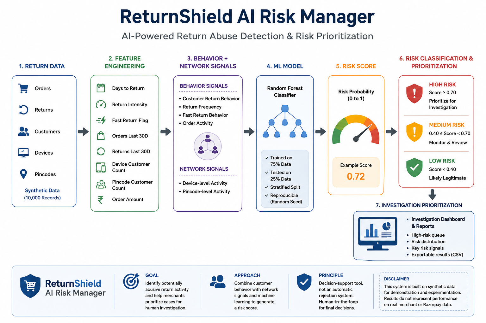

# ReturnShield AI Risk Manager

An AI-powered return-abuse detection and risk-prioritization system designed to identify potentially suspicious return activity and help merchants prioritize cases for human investigation.

## Problem

Return abuse can create financial losses and operational costs for merchants.

Simple rule-based systems can struggle when suspicious activity is distributed across multiple accounts, devices, or locations.

ReturnShield explores a machine-learning approach that combines:

- Customer return behavior
- Return frequency
- Fast-return behavior
- Order activity
- Device-level activity
- Pincode-level activity

## Solution

ReturnShield produces a risk signal that can be used to prioritize potentially suspicious returns for investigation.

The system is designed as a decision-support tool, not an automatic mechanism for rejecting customer returns.

## Architecture


```text
Synthetic Return Data
        |
        v
Feature Engineering
        |
        v
Behavior + Network Signals
        |
        v
Random Forest Model
        |
        v
Risk Probability
        |
        v
Low / Medium / High Risk
        |
        v
Investigation Prioritization

## Benchmark Results

ReturnShield was evaluated on a controlled synthetic benchmark of 10,000 records using a 75/25 train-test split and a 5% positive abuse-ring rate.

| Metric | Result |
|---|---:|
| Accuracy | 89.64% |
| Precision | 23.20% |
| Recall | 46.40% |
| F1 Score | 30.93% |
| ROC-AUC | 79.21% |

**Important:** These results are from synthetic data and should not be interpreted as performance on real Razorpay or merchant data.
